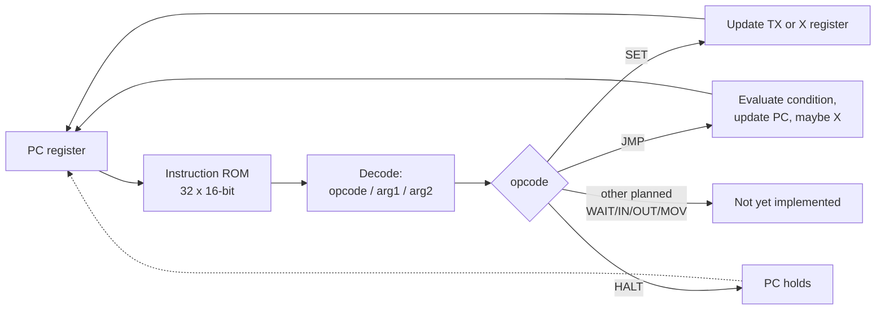

# Architecture

> **Status:** Living document - reflects the current implementation.
> Expect this to expand significantly as WAIT/IN/OUT/MOV, UART, and other
> protocols are added. See `roadmap.md` for what's planned and
> `decisions.md` for why things are built this way.

## Overview

SilverFox is a small, reprogrammable CPU built for bit-banging hardware
protocols. It should read pins, write pins, count cycles, branch on pin state, 
timed precisely enough to implement a real protocol in firmware rather
than fixed logic. See `isa.md` for the full instruction set.

The design flow is: write the core in **Hardcaml** (OCaml), generate
**Verilog** from it, and feed that Verilog into Tiny Tapeout's CMOS5L
synthesis/GDS pipeline.

```
hardcaml/src/isa.ml (Hardcaml source)
        |
        |  dune exec bin/generate.exe -- isa
        v
src/project.v (generated Verilog)
        |
        |  Tiny Tapeout CI (synthesis -> GDS)
        v
Fabricated silicon
```

## Repository layout
```
silverfox-tt/
├── hardcaml/              Hardcaml/OCaml source (OxCaml toolchain)
│   ├── dune-project
│   ├── src/
│   │   ├── isa.ml           Core CPU: decode, PC, registers
│   │   ├── isa.mli
│   │   ├── silverfox_core.ml  Placeholder counter (toolchain proof-of-concept)
│   │   └── silverfox_core.mli
│   ├── bin/
│   │   └── generate.ml      Emits Verilog for a chosen circuit
│   └── test/
│       └── isa_test.ml      hardcaml_test_harness unit tests
├── src/                    Generated Verilog lands here (project.v)
├── test/                   cocotb tests, run by Tiny Tapeout's CI
├── info.yaml               Tiny Tapeout project metadata (pinout, top module, tiles)
└── docs/                   This documentation
```

## Core module  `Isa`

The core is a single Hardcaml module (`hardcaml/src/isa.ml`) implementing
classic fetch/decode/execute, one instruction per clock cycle:

1. **Fetch** - the program counter (`PC`) indexes into a 32-entry
    instruction ROM. The ROM is currently implemented as a combinational
    `mux` over a fixed OCaml list of instructions (see
    `decisions.md` for why, and the revisit criteria as program size grows).
2. **Decode** - the fetched 16-bit instruction is split into 
    `opcode`/`arg1`/`arg2` fields (see `isa.md` for the exact bit layout).
3. **Execute** - implemented with Hardcaml's `Always` DSL as a nested
    if/else chain over the decoded opcode, updating `PC`, `X`, and `TX`
    registers as appropriate for the current instruction.



State is held in three registers:
- `PC` (5 bits) - program counter
- `X` (8 bits) - general-purpose down-counter, used for delay loops
- `TX` (1 bit) - current TX pin output value

All registers clear synchronously on `rst_n` (active-low, inverted
internally to match Hardcaml's active-high `Reg_spec` convention).

## Interface (`I`/`O`)

The module's Hardcaml interface matches Tiny Tapeout's required pin 
contract exactly, so the top-level generated circuit needs no wrapper:

| Signal     | Direction | Width | Purpose                           |
|------------|-----------|-------|-----------------------------------|
| `clk`      | in        | 1     | Clock                             |
| `rst_n`    | in        | 1     | Active-low reset                  |
| `ena`      | in        | 1     | Design enable (gates output)      |
| `ui_in`    | in        | 8     | Dedicated inputs — bit 0 is RX    |
| `uio_in`   | in        | 8     | Bidirectional pins, input side    |
| `uo_out`   | out       | 8     | Dedicated outputs — bit 0 is TX   |
| `uio_out`  | out       | 8     | Bidirectional pins, output side (currently tied to zero) |
| `uio_oe`   | out       | 8     | Bidirectional pin output-enable (currently tied to zero) |

Only `ui_in[0]` (RX) and `uo_out[0]` (TX) are used so far. The 
bidirectional pins (`uio_*`) are wired but unused - see `isa.md`'s pin
mapping table, which will expand as WAIT/IN/OUT/MOV and real protocols
are implemented.

## Verilog generation (`bin/generate.ml`)

`generate.ml` is a small command-line tool with one subcommand per
circuit that can be generated:

- `dune exec bin/generate.exe -- core` - the placeholder counter
  (`Silverfox_core`), kept as a known-good toolchain sanity check
- `dune exec bin/generate.exe -- isa` - the actual ISA core, generated
  under the Tiny-Tapeout-required top-level name `tt_um_silverfox_kleven2k`

Generated Verilog is written to `src/project.v`, which is what Tiny 
Tapeout's CI actually synthesizes - the Hardcaml source is never touched
by their pipeline directly.

## Toolchain
- **OxCaml** (OCaml 5.2 + Jane Street extensions), managed via `opam`
  switch `5.2.0+ox`
- **Hardcaml** for RTL generation, **hardcaml_test_harness** +
  **hardcaml_waveterm** for simulation/testing
- **dune** as the build system for the `hardcaml/` subproject
- Developed in **WSL2** (Ubuntu), editor tooling via VS Code's OCaml
  Platform extension (merlin/LSP)

## Verification

Two complementary layers (see `roadmap.md` Phase 5 for planned
additions like `hardcaml_verify` equivalence checking and AI-assisted
test generation):

1. **`hardcaml_test_harness`** (`hardcaml/test/isa_test.ml`) - fast,
  OCaml-native simulation of the Hardcaml source directly, before any
  Verilog is generated. Used for iterating on core logic quickly.
2. **cocotb** (`test/`, planned) - Python-based simulation of the actual
  generated Verilog, using Tiny Tapeout's required CI pipeline. This is
  the ground-truth check on what actually gets fabricated.

## Known constraints and open questions

[Host interface](host-interface.md) describes the runtime-programming work.
`Program_memory` and `Programmable_core` implement writable instruction
memory, halt/restart control, and state readback through internal
synchronous ports, tested in `hardcaml/test/programmable_core_test.ml`.
Both the existing ROM demos and the new core use the shared `Isa.execute`
decoder.

`Host_bridge` (`hardcaml/src/host_bridge.ml`) is now the TT top level
generated into `src/project.v`: a crude, pin-driven loader (a byte-wide bus
on `uio`, advanced by a strobe on `ui_in[1]`) standing in for the SPI
transport `host-interface.md` describes, until that's built. No protocol
program is baked into silicon anymore -- the fabricated chip boots idle and
a program is loaded, restarted, and read back entirely through pins, closing
the competition brief's core reprogrammability requirement. Verified at the
Hardcaml level (`hardcaml/test/host_bridge_test.ml`) and against the
generated Verilog via cocotb/Icarus (`test/test.py`); gate-level (post-
synthesis) verification has not yet been run against this design.

- Program memory is fixed at 32 instructions and implemented as
  register-based writable memory with combinational read - not yet
  evaluated for area efficiency against SRAM (see the competition
  brief's note that SRAM can be more area-efficient than flip-flops
  for instruction memory).
- One-cycle register latency exists between instruction execution and
  visible pin output — see `isa.md`'s timing note.
- Tile budget is 6x4 (24 tiles, roughly 24K logic cells per the 
  competition's rule-of-thumb) - not yet tracked against actual
  synthesis output, since no synthesis run has been done yet.
